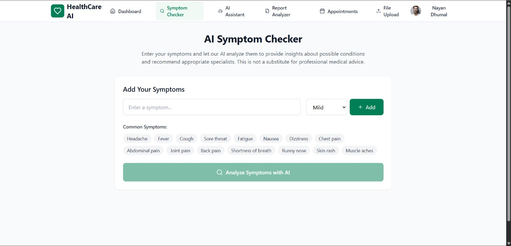
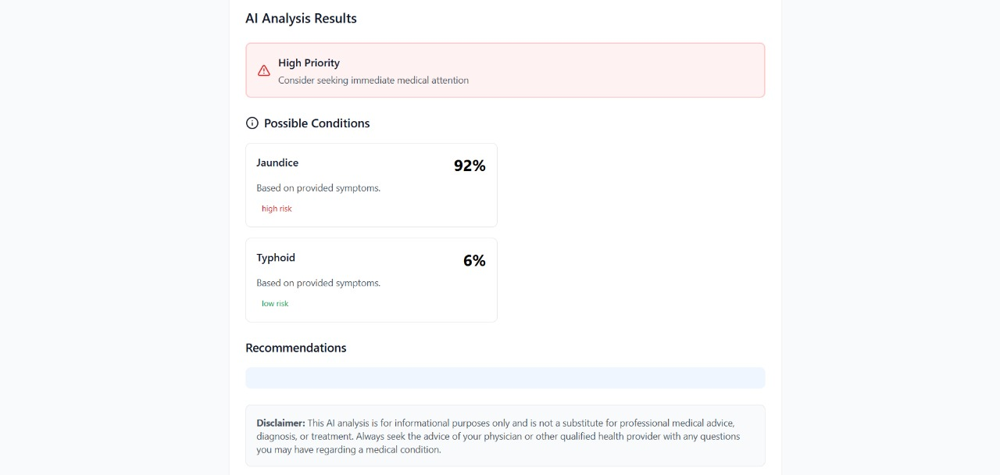

# 🏥 Aarogya AI – AI-Powered Healthcare Assistant

Aarogya AI is an intelligent healthcare assistant designed to help users make **early and informed decisions** about their health. It combines machine learning, data analysis, and intuitive visualization to simplify complex medical information.

---

## 🚀 Features

### 🔍 Symptom Checker
- Predicts possible diseases based on user-input symptoms  
- Provides risk-level insights for better awareness  

### 📄 Lab Report Analyzer
- Extracts medical parameters from PDF reports using `pdfplumber`  
- Compares values with standard medical ranges  
- Converts complex reports into easy-to-understand charts  

### 🤖 Healthcare Chatbot
- Answers queries related to symptoms, diseases, and reports  
- Works on controlled and domain-specific context  

### 📍 Doctor Finder
- Suggests nearby doctors based on predicted conditions  
- Uses custom dataset (no external paid APIs required)  

---

## 🧠 Tech Stack

**Frontend:**
- React.js  
- Chart.js  

**Backend:**
- Flask (Python)  

**AI / ML:**
- Machine Learning models for disease prediction  
- Rule-based + context-driven chatbot  

**Other Tools:**
- pdfplumber (PDF parsing)  
- JSON dataset (Doctor Finder)  

---

## ⚙️ How It Works

1. User inputs symptoms or uploads a lab report  
2. System processes data using ML models / parsing logic  
3. Results are analyzed and visualized  
4. Chatbot assists with additional queries  
5. Doctor suggestions are provided based on results  

---

## 📸 Screenshots

### 🔹 Input

### 🔹 Output

---

## 🔐 Privacy & Design Considerations

- Sensitive medical data is not stored permanently  
- No third-party APIs used for critical data handling  
- Chatbot operates in a controlled, domain-specific environment  

---

## 🚧 Future Improvements

- More accurate ML models with larger datasets  
- Multi-language support  
- Enhanced PDF parsing for varied report formats  
- Improved UI/UX for better user experience  

---

## 💡 Motivation

Healthcare information is often complex and difficult to interpret for non-medical users. Aarogya AI aims to bridge this gap by making medical insights **accessible, understandable, and actionable**.

---

## 📌 Note

This system is designed to provide **supportive insights only** and does not replace professional medical advice.

---

## 👨‍💻 Author

**Aditya Jagtap**  
AI + Full Stack Developer  
